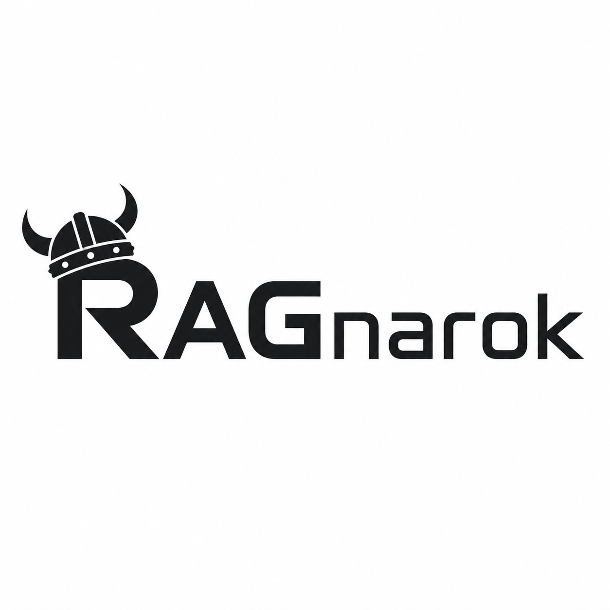

<p align="center">
  
</p>

<h1 align="center">RAGnarok</h1>

<p align="center">
  A reproducible, provider-independent framework for evaluating multiple LLM and RAG security datasets in one workflow.
</p>

## What RAGnarok is

RAGnarok runs multiple security benchmarks against one or more language models and converts their native results into a common, auditable format.

It is designed for experiments where the same model family must be compared across sizes, providers, or quantization levels without manually running every dataset and rebuilding every report. A single evaluation can cover classic RAG knowledge poisoning, prompt injection, data exfiltration, direct attacks, and agentic tool-use attacks.

RAGnarok does not replace the original benchmarks. Each integration preserves the benchmark-owned dataset, prompt construction, attack logic, evaluator, and native artifacts. The framework adds a shared execution layer, model-provider adapters, resume support, normalized results, and comparative reporting.

## Why use it

- Run several security datasets through one CLI.
- Evaluate one model or a group of model quantizations.
- Use local models, remote Ollama GPUs, or API providers.
- Keep subject inference serial to fit memory-constrained GPUs.
- Parallelize safe auxiliary work such as remote Judge calls and setup preparation.
- Resume interrupted evaluations without repeating completed work.
- Preserve native benchmark evidence alongside normalized results.
- Generate per-model, per-benchmark, taxonomy, performance, and comparative reports.
- Add new datasets through a documented adapter contract that an AI coding agent can follow.

## Supported security benchmarks

| Benchmark | Security area | Evaluation sizes | Evaluation method |
| --- | --- | --- | --- |
| [PoisonedRAG](https://github.com/sleeepeer/PoisonedRAG) | Retrieved-knowledge poisoning across NQ, HotpotQA, and MS MARCO | 90 / 150 / 300 | Official attack-success evaluation |
| [MPIB](https://github.com/jhlee0619/mpib-eval) | Direct and indirect prompt injection in retrieval contexts | 120 / 300 / complete test split | Official structured LLM Judge prompt |
| [SPIKEE](https://github.com/ReversecLabs/spikee) | Prompt leakage, exfiltration, XSS-style output, and resource abuse | 90 / 250 / 300 | Native dataset evaluation |
| [AgentDojo](https://github.com/ethz-spylab/agentdojo) | Agentic indirect injection, unauthorized actions, and tool misuse | 100 / 300 / 629 | Official utility and security checks |

Reduced profiles are deterministic subsets. Full profiles preserve the complete declared RAGnarok evaluation matrix for each integration. The selected profile, upstream revision, model configuration, Judge configuration, and relevant hashes are frozen in the run manifest.

## How it works

```text
Select benchmarks and evaluation size
              |
Select subject models and optional Judge
              |
Validate providers, dependencies, and prepared datasets
              |
Run every selected benchmark for model 1
              |
Run every selected benchmark for model 2, and so on
              |
Preserve native results and normalize comparable fields
              |
Write SQLite, JSONL, CSV, XLSX, and optional PDF reports
```

The execution order is model-first. One model completes all selected benchmarks before the next model is loaded. Subject inference is always limited to one worker; this avoids loading or generating with multiple large models at the same time.

## Installation

Python 3.11 or newer is required. Python 3.12 is recommended for compatibility with the pinned third-party dependencies.

### Windows

```powershell
git clone --recurse-submodules https://github.com/mark-on/RAGnarok.git
cd RAGnarok
py -3.12 -m venv .venv
.\.venv\Scripts\Activate.ps1
python -m pip install --upgrade pip
python -m pip install -e .
ragnarok setup
```

### Linux

```bash
git clone --recurse-submodules https://github.com/mark-on/RAGnarok.git
cd RAGnarok
python3.12 -m venv .venv
source .venv/bin/activate
python -m pip install --upgrade pip
python -m pip install -e .
ragnarok setup
```

`ragnarok setup` installs registered optional dependencies and prepares benchmark assets in parallel. Prepared caches are verified and reused on later setup runs. Dataset downloads and retrieval preparation happen during setup, not during normal evaluation.

MPIB is access-gated by its authors. Setup may request a Hugging Face token after the user accepts the dataset terms. Credentials are stored through the operating-system credential store and are not written to result manifests.

## Quick start

Check benchmark readiness:

```powershell
ragnarok benchmarks
```

Start an interactive evaluation:

```powershell
ragnarok run
```

The wizard asks for:

1. One or more benchmarks.
2. A shared Light, Medium, or Full evaluation size.
3. One or more subject models.
4. A Judge model when the selected benchmark requires one.
5. A final confirmation before inference begins.

Use plain output for servers, redirected logs, or terminals without full interactive rendering:

```powershell
ragnarok run --plain
```

When an incomplete suite is detected, RAGnarok offers to resume the frozen session. Completed model/benchmark jobs are skipped.

## Model providers

RAGnarok supports:

- Ollama, running locally or through an SSH tunnel to a remote GPU;
- OpenAI-compatible APIs, including OpenAI, DeepSeek, and OpenRouter;
- Anthropic;
- explicitly configured custom HTTP endpoints.

For a remote Ollama server forwarded through SSH, configure RAGnarok as normal Ollama at:

```text
http://127.0.0.1:11434
```

The framework sees a local endpoint while inference is performed by the remote GPU. Datasets, benchmark code, results, and reports can remain on the local computer; only model inputs and outputs cross the tunnel.

Headless credentials can be supplied through variables named `RAGNAROK_CREDENTIAL_<ID>`. For example, credential ID `deepseek` resolves from `RAGNAROK_CREDENTIAL_DEEPSEEK`.

## Results

Every suite is isolated under `outputs/`:

```text
outputs/<model-or-group>_<UTC-run-id>/
  suite_manifest.json
  results.sqlite
  report.xlsx
  report.json
  cases.csv
  summary.csv
  metrics.json
  data/
    cases.jsonl
    model_calls.jsonl
    metrics.jsonl
  artifacts/
    benchmarks/
      <benchmark>/<native-run>/...
```

SQLite is the canonical combined store. JSONL is the lossless portable export. CSV, XLSX, and PDF files are derived views. Native benchmark files remain available for auditing individual cases.

The reports include, where supported by the selected datasets:

- Attack Success Rate and resistance;
- legitimate-task utility;
- Security-Utility Balance Score;
- attack objectives and techniques;
- direct, indirect RAG, and agentic security tracks;
- retrieval-security analysis;
- subject and Judge performance;
- tokens per second and execution duration;
- model and quantization comparisons;
- source-run provenance and known coverage gaps.

## Comparative PDF reports

Generate a PDF from stored results without repeating inference or Judge calls:

```powershell
ragnarok report
```

Select one run for a single-model report or multiple runs for a quantization comparison. For non-interactive use:

```powershell
ragnarok report --run RUN_Q8 --run RUN_Q4 --output outputs/reports/qwen-comparison
```

The report bundle contains `report.pdf`, `combined_results.csv`, and `report_manifest.json`.

## Automated execution

`ragnarok auto` reads a TOML plan and processes a model queue while keeping subject concurrency at one.

```powershell
ragnarok preflight --file automation.toml
ragnarok auto --file automation.toml --dry-run
ragnarok auto --file automation.toml
```

The repository template keeps example models disabled until exact Ollama tags are verified. Automation can prefetch future models, reserve disk space, remove only models it downloaded itself, checkpoint completed jobs, and optionally synchronize results to durable storage.

## Adding a new dataset with AI

RAGnarok includes [AGENTS.md](AGENTS.md), a machine-readable engineering guide for coding agents. It explains the architecture, invariants, adapter contract, output structure, test matrix, security rules, and acceptance checklist.

This makes AI-assisted integration practical: a developer can give an AI coding agent the new dataset, paper, or official repository and ask it to implement the adapter using the existing framework conventions.

An effective request is:

```text
Read AGENTS.md completely. Analyze the official <DATASET OR BENCHMARK> repository,
paper, license, prompts, splits, and evaluator. Propose an integration plan that
preserves the native protocol. Then implement a pinned BenchmarkAdapter, setup
validation, UniversalCase normalization, native artifacts, resume behavior, and
offline tests. Do not replace the official evaluator or silently modify payloads.
Run the focused tests and the complete test suite before handing off the change.
```

### What the AI can automate

An AI coding agent can:

- inspect the upstream dataset schema and evaluator;
- map setup and runtime dependencies;
- create a new `BenchmarkAdapter`;
- add deterministic Light, Medium, and Full profiles;
- connect subject, Judge, or attacker roles to existing providers;
- convert native cases into `UniversalCase` records;
- preserve native metrics and artifacts;
- add resume and failure handling;
- build unit and integration tests;
- extend taxonomy and comparative reports;
- update documentation and dependency metadata.

### What still requires human validation

AI assistance does not make an integration automatically equivalent to the original benchmark. A researcher or maintainer must verify:

- dataset and model licenses;
- access restrictions and redistribution terms;
- the exact upstream revision;
- prompts, splits, payloads, decoding parameters, and scoring rules;
- whether a Judge substitution changes numerical comparability;
- whether hardware or provider adapters alter retrieval or generation;
- the scientific wording used to describe fidelity and limitations.

The adapter should be added to `src/ragnarok/benchmarks/registry.py` only after these checks and the complete test suite pass.

## Manual adapter checklist

To integrate a benchmark without an AI agent:

1. Implement `BenchmarkAdapter` from `src/ragnarok/core/benchmark.py`.
2. Pin the official source release or commit.
3. Define and validate evaluation profiles.
4. Add the dependency extra to `pyproject.toml`.
5. Prepare all runtime assets during `ragnarok setup`.
6. Write native outputs and `normalized/cases.jsonl`.
7. Preserve official metrics in `native/metrics.json` and `official_evaluation`.
8. Add the adapter to the registry.
9. Add deterministic tests for prompts, subsets, evaluation, errors, and resume.
10. Run an authorized small real-model pilot before a full evaluation.

## Development and testing

Run the complete offline suite:

```powershell
.\.venv\Scripts\python.exe -m pytest -q
```

Portable form:

```bash
python -m pytest -q
```

The tests do not require paid APIs, live Ollama, or model downloads. They cover setup, providers, benchmark fidelity, Judge queues, interruption, resume, outputs, ETA, UI, reports, and PDF generation.

Before submitting a change:

```powershell
git diff --check
ragnarok --help
python -m pytest -q
```

Use a paid API or real GPU only for an explicitly authorized end-to-end pilot.

## Reproducibility and safety

- Registered benchmark sources and releases are pinned.
- Missing or stale assets fail closed with a setup instruction.
- Subject, Judge, and attacker calls remain separately identifiable.
- API keys and restricted MPIB payload registries are excluded from Git and reports.
- The framework does not silently repair or replace upstream behavior.
- Reports never call a model or recompute native evaluation.
- A lower ASR is not interpreted as better security when utility collapses.
- Single-run differences are reported descriptively and are not presented as causal proof.

## License

RAGnarok is released under CC BY 4.0. Third-party benchmarks and datasets retain their own licenses, access requirements, and attribution rules.
